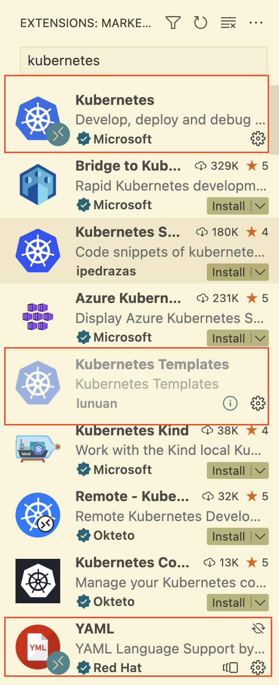

# 1️⃣ Setup
### ZSH autocompletions
Add the two following lines at the end of your ~/.zshrc file then reopen a new terminal:
```
[[ $commands[kubectl] ]] && source <(kubectl completion zsh)
[[ $commands[minikube] ]] && source <(minikube completion zsh)
```

If you type minikube <TAB> or kubectl <TAB> it should give you a list of commands

Furthermore, install the dependencies using Poetry:
```
pip install poetry
poetry install
poetry shell
```

### VScode Extensions
Before you get started there are some key extensions we need for VSCode to make developing k8s a breeze 🥶. Make sure you have Kubernetes, Kubernetes templates, and YAML - all highlighted in the image below 👇.




# 2️⃣ Launching Minikube
The first step is to make sure that your Docker daemon is running. One way to do this is to start Docker Desktop on your machine. Then run the following command from your terminal:
```bash
minikube start
```

Starting minikube can take a few minutes. You should get the following message:
```bash
🏄  Done! kubectl is now configured to use "minikube" cluster and "default" namespace by default
```

This means that you are now able to interact with the minikube cluster using `kubectl`. One thing that we can do is to inspect the cluster node:
```bash
kubectl get node
```

You should see something like:
```
NAME       STATUS   ROLES           AGE   VERSION
minikube   Ready    control-plane   76d   v1.25.2
```

# 3️⃣ Build and run docker images inside your cluster
❓ Use the following command to build and run docker image inside the `minikube` environment:
```bash
eval $(minikube docker-env)
```

See the [following](https://stackoverflow.com/questions/52310599/what-does-minikube-docker-env-mean) Stackoverflow page for a more elaborate explanation of this.

❓ Now build the Dockerfile against the docker inside Minikube, which is instantly accessible to Kubernetes cluster.
```
docker build -t app .
```

# 4️⃣ Create a K8s Service
❓ Create your own `api-service.yaml` in the `k8s-deployment/api` folder and populate it with a `LoadBalancer` service, with name `fastapi-service` and selector app: `fastapi`. What port should you it target ?

<details>
  <summary markdown='span'> 💡 Target hint </summary>
    The target port should correspond to the port on which you are exposing your Fastapi application.
</details>

❓ Apply the service by running:
```bash
kubectl apply -f api-service.yaml
```

# 5️⃣ Create a K8s Deployment
❓ Create a configuration file for our deployment - `k8s-deployment/api/api-deployment.yaml`
❓ Apply the deployment by running:
```bash
kubectl apply -f api-deployment.yaml
```

# 6️⃣ Forwarding the service
```bash
kubectl port-forward service/fastapi-service 8000:4000
```

# 7️⃣ Sending a request
Go to `http://localhost:8000` in your browser, you should see the following message:
```
{"message":"API is up and running!"}
```

Or send a post request to the `/predict` endpoint by running:
```bash
poetry run python -m api.api_requests -e predict
```
This should return a list of tuples with a prediction per ID for the `data/test.csv` file.

Or send a post request to the `/train` endpoint by running:
```bash
poetry run python -m api.api_requests -e train
```

This will train a Random Forest model on `data/train.csv` and save a model under `artifacts/rf.pkl`.

# 8️⃣ Incorporate a database 💾
### 8.1) Volumes
It is now time to incorporate Postgres into the setup in order to store the data and the results from the ML model. Just like in Docker-compose we need to keep our Postgres data into volumes. In Kubernetes there are two parts to volumes though - **volumes**, and **volume claims**.
- **Volumes**: this creates the space on the cluster for a database
- **Volume claims**: this gives a pod access to that volume - it therefore describes how the pod will be accessing the volume and how much space it can claim on this total volume.

❓ Incorporate a volume in `k8s-deployment/postgres/postgres-pv.yaml`
❓ Incorporate a volume claim in `k8s-deployment/postgres/postgres-pvc.yaml`

### 8.2) Secrets
ConfigMaps provide a means to store environment parameters in Kubernetes, to be fetched by a Pod when it starts. Values in a ConfigMap and be key-pair strings, entire files, or both. Which you use depends on your implementation.
```yaml
apiVersion: v1
kind: ConfigMap
metadata:
  name: postgres
data:
  POSTGRES_DB: myapp_production
```

For sensitive data, such as user credentials, Kubernetes Secrets allow you to more safely store data in the cluster. Like ConfigMap, the values in a Secret can be fetched by a Pod during startup. We need to store some environment variables such as the Postgres user and password as secrets.

❓ Create another file `postgres-secret.yaml`. You can use the k8sSecret template. Then set the name to postgres-secrets.
```bash
apiVersion: v1
kind: Secret
metadata:
  name: postgres-secrets
  namespace: default
type: Opaque
data:
  POSTGRES_USER: dXNlcg==
  POSTGRES_PASSWORD: cGFzc3dvcmQ=
```

Notice the value used for POSTGRES_PASSWORD. That value is not the actual password. Rather, it is base64 encoded string of the password. Do not confuse base64 encoding with encryption. It merely serves to obfuscate the password to prevent prying eyes from easily reading it.

```
printf password | base64
```

Now we have our secrets and are ready to create our Postgres pod! 🚀

### 8.3) Statefulset
**Statefulsets** are like **Deployments**, except that a **StatefulSet** maintains a sticky identity for each of their pods. If you want to use storage volumes to provide **persistence** for your workload, you can use a StatefulSet as part of the solution. Although individual Pods in a StatefulSet are susceptible to failure, the persistent pod identifiers make it easier to match existing volumes to the new Pods that replace any that have failed.

❓ Create another file called `postgres-statefulset.yaml`. Use the `k8sStatefulSet` template to create the outline and fill it with the right values.
