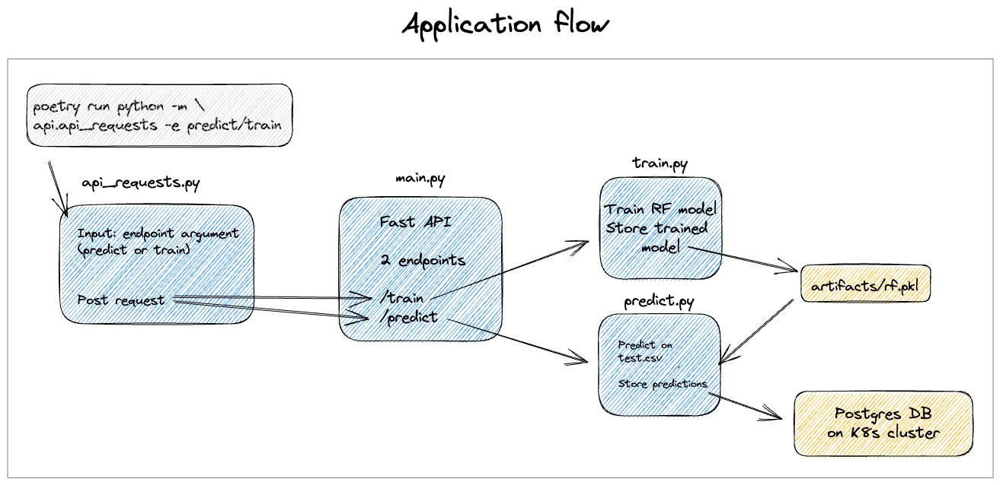

# Introduction
You will be deploying a machine learning API, which can be found in the `api` subdirectory. Here is the main flow of the API:



The main things that you should know is that we want to store the predictions of the API in a Postgres container on the K8s cluster and that the API is packaged into a Docker image using the Dockerfile in the root directory.


# 1️⃣ Setup
Intallation instructions for Minikube can be found here: https://minikube.sigs.k8s.io/docs/start/

### ZSH autocompletions
Add the two following lines at the end of your ~/.zshrc file then reopen a new terminal:
```
[[ $commands[kubectl] ]] && source <(kubectl completion zsh)
[[ $commands[minikube] ]] && source <(minikube completion zsh)
```

If you type `minikube` <TAB> or `kubectl` <TAB> it should give you a list of commands

Furthermore, install the dependencies using Poetry:
```
pip install poetry
poetry install
poetry shell
```

### VScode Extensions
Before you get started there are some key extensions we need for VSCode to make developing k8s a breeze 🥶. Make sure you have Kubernetes, Kubernetes templates, and YAML - all highlighted in the image below 👇.


# 2️⃣ Launching Minikube

The first step is to make sure that your Docker daemon is running. One way to do this is to start Docker Desktop on your machine. Then run the following command from your terminal:
```bash
minikube start
```

Starting minikube can take a few minutes. You should get the following message:
```bash
🏄  Done! kubectl is now configured to use "minikube" cluster and "default" namespace by default
```

This means that you are now able to interact with the minikube cluster using `kubectl`. One thing that we can do is to inspect the cluster node:
```bash
kubectl get node
```

You should see something like:
```
NAME       STATUS   ROLES           AGE   VERSION
minikube   Ready    control-plane   76d   v1.25.2
```

# 3️⃣ Build and run docker images inside your cluster
❓ Use the following command to build and run docker image inside the `minikube` environment:
```bash
eval $(minikube docker-env)
```

See the [following](https://stackoverflow.com/questions/52310599/what-does-minikube-docker-env-mean) Stackoverflow page for a more elaborate explanation of this.

❓ Now build the Dockerfile against the docker inside Minikube, which is instantly accessible to Kubernetes cluster.
```
docker build -t app .
```

# 4️⃣ Create a K8s Service
❓ Create your own `api-service.yaml` in the `k8s-deployment/api` folder and populate it with a `LoadBalancer` service, with name `fastapi-service` and selector app: `fastapi`. Which port should it target ?

<details>
  <summary markdown='span'> 💡 Target hint </summary>
    The target port should correspond to the port on which you are exposing your Fastapi application.
</details>

❓ Apply the service by running:
```bash
kubectl apply -f api-service.yaml
```

# 5️⃣ Create a K8s Deployment
❓ Create a configuration file for our deployment - `k8s-deployment/api/api-deployment.yaml`

❓ Apply the deployment by running:
```bash
kubectl apply -f api-deployment.yaml
```

# 6️⃣ Forwarding the service
```bash
kubectl port-forward service/fastapi-service 8000:8000
```

# 7️⃣ Sending a request
Go to `http://localhost:8000` in your browser, you should see the following message:
```
{"message":"API is up and running!"}
```

Or send a post request to the `/train` endpoint by running:
```bash
poetry run python -m api.api_requests -e train
```

This will train a Random Forest model on `data/train.csv` and save a model under `artifacts/rf.pkl`.

Before we can trigger the `\predict` endpoint we need to set up a database in order to store the predictions.

# 8️⃣ Set up a Cron job
We want to train our model every day at 8am. We can do this by creating a Cron job.

❓ Create a file `cronjob.yaml`. You can use the k8CronJob template. Then set the name to `train-model`. The command that we want to run is `python -m api.api_requests -e train`. The schedule should be `0 8 * * *`.

<details>
  <summary markdown='span'> 💡 Hint </summary>
    You need to set an ENV variable in the container env to your fastapi service. You can do this by adding the following line to the container spec:

    ```yaml
    env:
    - name: ENV
      value: "fastapi-service"
    ```
    This is because the api_requests file uses this env variable as an input to determine where it should send the request to.
</details>

❓ It is also possible to manually test the cronjob, have a look into the documentation for more information.

  
# 8️⃣.5️⃣ Updating your deployment
Make a small change to the code of the API (e.g. an extra print statement), and see if you can rebuild your image with a new tag and update the deployment with this new image. Check the cheatsheet if you are not sure on how to do this. 

# 9️⃣ Incorporate a database 💾
### 9.1) Volumes
It is now time to incorporate Postgres into the setup in order to store the data and the results from the ML model. Just like in Docker-compose we need to keep our Postgres data into volumes. In Kubernetes there are two parts to volumes though - **volumes**, and **volume claims**.
- **Volumes**: this creates the space on the cluster for a database
- **Volume claims**: this gives a pod access to that volume - it therefore describes how the pod will be accessing the volume and how much space it can claim on this total volume.

❓ Incorporate a volume in `k8s-deployment/postgres/postgres-pv.yaml`

❓ Incorporate a volume claim in `k8s-deployment/postgres/postgres-pvc.yaml`

### 9.2) ConfigMap
`ConfigMaps` provide a means to store environment parameters in Kubernetes, to be fetched by a Pod when it starts. Here is an example:

```yaml
apiVersion: v1
kind: ConfigMap
metadata:
  name: postgres
data:
  POSTGRES_DB: myapp_production
```

❓ Create a file `postgres-configmaps.yaml`. You can use the k8ConfigMap template. Then set the name to `postgres-env`. There are 3 environment variables that we need to set:
1. POSTGRES_DB 👉 you can use any name
2. POSTGRES_HOST 👉 you can use any name
3. POSTGRES_PORT 👉 this should be "5432"


### 9.3) Secrets
For sensitive data, such as user credentials, **Kubernetes Secrets** allow you to more safely store data in the cluster. Like **ConfigMap**, the values in a Secret can be fetched by a Pod during startup. We need to store some environment variables such as the Postgres user and password as secrets.

❓ Create another file `postgres-secret.yaml`. You can use the **k8sSecret** template. Then set the name to `postgres-secrets`. The variables that we need to set are:
1. POSTGRES_USER
2. POSTGRES_PASSWORD

Do not use any actual hard-coded values for POSTGRES_PASSWORD. Rather, use a **base64** encoded string of the password. Do not confuse base64 encoding with encryption. It merely serves to obfuscate the password to prevent prying eyes from easily reading it.

```
printf password | base64
```

Now we have our secrets and are ready to create our Postgres pod! 🚀


### 9.4) Statefulset
**Statefulsets** are like **Deployments**, except that a **StatefulSet** maintains a sticky identity for each of their pods. If you want to use storage volumes to provide **persistence** for your workload, you can use a **StatefulSet** as part of the solution. Although individual Pods in a StatefulSet are susceptible to failure, the **persistent** pod identifiers make it easier to match existing volumes to the new Pods that **replace** any that have failed ❌.

❓ Create another file called `postgres-statefulset.yaml`. Use the `k8sStatefulSet` template to create the outline and fill it with the right values. You need to use the environment variables from your ConfigMaps file and the secrets from `postgres-secrets`.

❓ Furthermore, you need to mount the `/var/lib/postgresql/data` path in the **postgres** container to a volume

❓ Also make a persistentVolumeClaim using the mounted volume 👆


### 9.5) Service
❓ Also create a service file for your Postgres statefulset. The targetPort should be the same as the one statefulset is exposing.

### 9.6) Connect it all together!
Apply your postgres configuration by running from the **k8s-deployment** subdirectory:

```bash
kubectl apply -f . --recursive
```
  
### 9.6.5 
Now that the database is up and running, we need to actually create a database in the container. 

```bash
kubectl exec -it postgres-statefulset-0 -- psql -h localhost -U user --password -p 5432
```
Fill in your password. Then create a database using:

```bash
CREATE database database;
```
  
### 9.7) Test your solution
Port-forward your fastapi-server again and send a post request to the `/predict` endpoint by running:
```bash
poetry run python -m api.api_requests -e predict
```

This should store predictions for the `data/test.csv` file into the `postgres` database. 🎉🎉🎉
# 1️⃣0️⃣ Setting up Loki
Loki is a horizontally scalable, highly available, multi-tenant log aggregation system inspired by Prometheus. It makes it much more convenient to view your Kubernetes logs and to set alerts on them, which you can for example send to a Slack channel.

Instead of writing our own deployment and service file, we can also use [Helm](https://helm.sh) charts to immediately deploy the application onto our cluster. Installation instructions for Helm can be found [here](https://helm.sh/docs/intro/install/).

Once Helm is installed, you can run the following command to install Loki using Helm:
```bash
helm upgrade --install loki grafana/loki-stack  --set grafana.enabled=true,loki.persistence.enabled=true,loki.persistence.storageClassName=nfs-client,loki.persistence.size=5Gi
```

When exploring our cluster in `Lens` we can see that a new **Daemonset** has been created, called `loki-promtail`. Promtail is an agent which ships the contents of local logs to a Loki. A **Daemonset** ensures that a copy of a pod runs on every node, which is an important property for the collection of logs.

❓ To access the application on our machine we need to port-forward the service. Run the relevant `kubectl` command to forward the right port.

To get the admin password for the Grafana pod, run the following command:
```bash
kubectl get secret loki-grafana -o jsonpath="{.data.admin-password}" | base64 --decode ; echo
```

Navigate to `http://localhost:3000` and login with admin and the password output above.
  
# 1️⃣1️⃣ Setting up Streamlit
Create an extra deployment and service for the Streamlit application, which can be found in the dashboard subdirectory.
  
# 1️⃣2️⃣ Setting up Adminer
Set up an Adminer service to be able to interact with the database using a UI. https://hub.docker.com/_/adminer

# 1️⃣3️⃣ Autoscaling


1. We start with enabling the metrics server in minikube. By default it's turned off but it is neccessary to monitor the resources (like cpu and ram) a pod uses. A horizontalPodAutoscaler needs that information the decide whether it should scale up or down an application.
    ```
    minikube addons enable metrics-server
    ```

1. Check if the metrics-server is enabled.
    ```
    minikube addons list
    ```

1. Have a look at the `k8s-deployment/scaling/deployment.yaml` and `k8s-deployment/scaling/service.yaml` and apply them to the cluster.
    
    How many pods are created by the deployment?

1. Examine `k8s-deployment/scaling/hpa.yaml` and apply the HorizontalPodAutoscaler to the cluster.

    As you may notice, the deployment in the cluster now differece from the version you applied to the cluster.

1. Now we are going to increase the load to the pods of our deployment, and see how this effects the replicas. You can monitor the pods in your cluster with the kubernetes dashboard or on the command line.

    Increase the load:
    ```
    kubectl run -i --tty load-generator --rm --image=busybox:1.28 --restart=Never -- /bin/sh -c "while sleep 0.01; do wget -q -O- http://php-apache; done"

    ```

    Decrease the load by interupting the command with `CTRL-C`.

6. Instructions are based on this [blogpost](https://www.bogotobogo.com/DevOps/Docker/Docker-Kubernetes-Horizontal-Pod-Autoscaler.php) and the kubernetes [documentation](https://kubernetes.io/docs/tasks/run-application/horizontal-pod-autoscale-walkthrough/).
